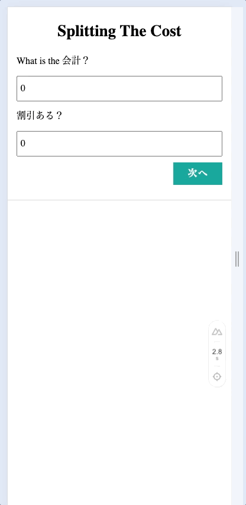

# Splitting The Cost!
計算機を持ちながら自分で計算することをやめるようにレシートなどの割り勘アプリを作成しました！

## イメージ


Github Pages: https://perrym123.github.io/splitting-the-cost/

## いつかやりたいこと
- [ ] github page作成
- [ ] もっとAtomicDesignを活用する
- [ ] 以前登録したデータをlocal storageに保存
- [ ] nodeバージョンを固定(nvmrcなど)
- [ ] Vue Testing Libraryを利用（[参考](https://github.com/testing-library/vue-testing-library)）
- [ ] バックエンドと連携し、Dockerのコンテナ化
- [ ] 多言語サポート（日本語 ＆ 英語）

## Setup

Make sure to install the dependencies:

```bash
yarn install
```

## Development Server

```bash
yarn dev
```

### 手元のスマホ端末で動作確認したい場合

```bash
$ yarn dev:host
```
